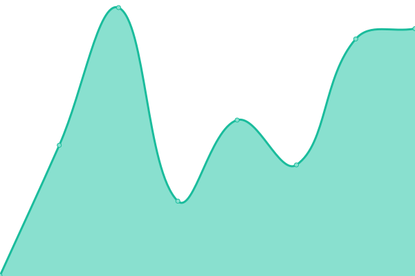
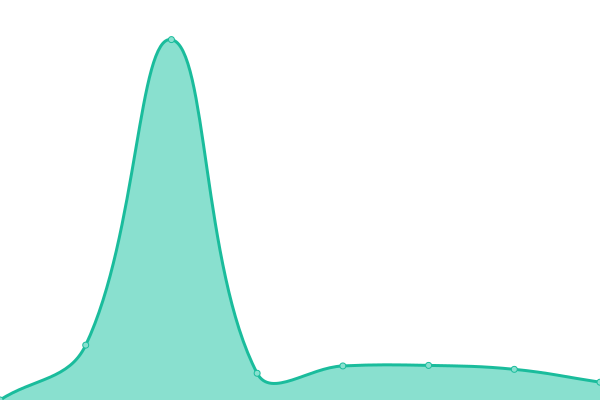

# [📈 Live Status](https://demo.upptime.js.org): <!--live status--> **🟧 Partial outage**

This repository contains the open-source uptime monitor and status page for [HaxPro](https://demo.upptime.js.org), powered by [Upptime](https://github.com/upptime/upptime).

With [Upptime](https://upptime.js.org), you can get your own unlimited and free uptime monitor and status page, powered entirely by a GitHub repository. We use [Issues](https://github.com/haxspro/upptime/issues) as incident reports, [Actions](https://github.com/haxspro/upptime/actions) as uptime monitors, and [Pages](https://demo.upptime.js.org) for the status page.

<!--start: status pages-->
<!-- This summary is generated by Upptime (https://github.com/upptime/upptime) -->
<!-- Do not edit this manually, your changes will be overwritten -->
<!-- prettier-ignore -->
| URL | Status | History | Response Time | Uptime |
| --- | ------ | ------- | ------------- | ------ |
|  [DooD API v1 [fastapi]](https://api.pakai.eu.org/ping) | 🟩 Up | [doo-d-api-v1-fastapi.yml](https://github.com/haxspro/upptime/commits/HEAD/history/doo-d-api-v1-fastapi.yml) | 

 404ms
     
 | 

<a href="https://uptime.pakai.eu.org/history/doo-d-api-v1-fastapi">100.00%</a>
    

|  [DooD API v2 [flask]](https://f-api.pakai.eu.org/ping) | 🟩 Up | [doo-d-api-v2-flask.yml](https://github.com/haxspro/upptime/commits/HEAD/history/doo-d-api-v2-flask.yml) | 

 238ms
     
 | 

<a href="https://uptime.pakai.eu.org/history/doo-d-api-v2-flask">100.00%</a>
    

|  [DooD API v3 [fastapi]](https://api.noobzhax.com/ping) | 🟩 Up | [doo-d-api-v3-fastapi.yml](https://github.com/haxspro/upptime/commits/HEAD/history/doo-d-api-v3-fastapi.yml) | 

 68ms
     
 | 

<a href="https://uptime.pakai.eu.org/history/doo-d-api-v3-fastapi">100.00%</a>
    

|  [SUBSCENE.EU.ORG](https://subscene.eu.org) | 🟩 Up | [subscene-eu-org.yml](https://github.com/haxspro/upptime/commits/HEAD/history/subscene-eu-org.yml) | 

 1084ms
     
 | 

<a href="https://uptime.pakai.eu.org/history/subscene-eu-org">100.00%</a>
    

|  [SOFTSUB.EU.ORG](https://softsub.eu.org) | 🟩 Up | [softsub-eu-org.yml](https://github.com/haxspro/upptime/commits/HEAD/history/softsub-eu-org.yml) | 

 931ms
     
 | 

<a href="https://uptime.pakai.eu.org/history/softsub-eu-org">100.00%</a>
    

|  [SUB.BERKAS.EU.ORG](https://sub.berkas.eu.org) | 🟥 Down | [sub-berkas-eu-org.yml](https://github.com/haxspro/upptime/commits/HEAD/history/sub-berkas-eu-org.yml) | 

 136ms
     
 | 

<a href="https://uptime.pakai.eu.org/history/sub-berkas-eu-org">7.47%</a>
    

|  [SUBSCENE.COM](https://subscene.com) | 🟥 Down | [subscene-com.yml](https://github.com/haxspro/upptime/commits/HEAD/history/subscene-com.yml) | 

 89ms
     
 | 

<a href="https://uptime.pakai.eu.org/history/subscene-com">0.00%</a>
    

<!--end: status pages-->

[**Visit our status website →**](https://demo.upptime.js.org)

## 📄 License

- Powered by: [Upptime](https://github.com/upptime/upptime)
- Code: [MIT](./LICENSE) © [HaxPro](https://demo.upptime.js.org)
- Data in the `./history` directory: [Open Database License](https://opendatacommons.org/licenses/odbl/1-0/)
